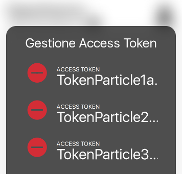
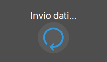
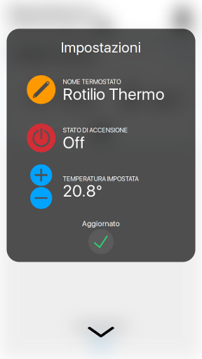

# Openthermo - App Mobile Open Source

Un'app elegante, open source, per controllare facilmente i tuoi sistemi di riscaldamento dallo smartphone.

Con questo tutorial imparerai a costruire una web app per monitorare e comandare i termostati di casa e ufficio dal tuo smartphone, ovunque tu sia.

Questa è l'ultima parte del progetto opensource Openthermo, che sfrutta il potenziale della piattaforma IoT [Rotilio Maker](https://techmakers.io/rotilio-maker.html). L'App è dedicata ai termostati IoT *Rotilio thermo* e si basa su un programma *lato server*. Se non l'hai ancora fatto, segui il [tutorial di Rotilio thermo](http://techmakers.io/formaker/termostatoopensource/rotilio-thermo-termostato-open-source.html) e il [tutorial del Server Openthermo](link al tutorial del server) per saperne di più sul mondo IoT e realizzare ciò di cui avrai bisogno.


Per iniziare, seguiremo questi step:

- introduciamo la piattaforma utilizzata
- prepariamo la struttura dell'app
- parliamo del design dell'interfaccia

Esploreremo lo sviluppo dell'app passo dopo passo. Ecco quali saranno i suoi compiti fondamentali:

- gestire l'aggiunta o la rimozione di access token
- visualizzare sinteticamente tutti i termostati connessi, con i loro dati
- permettere di cambiare le impostazioni di un termostato

La disposizione di queste funzioni sullo schermo è cruciale: dovremo rendere l'uso dell'utente il più comodo e veloce possibile, come se utilizzasse un vero termostato. Grazie a questo tutorial imparerai infatti a disegnare applicazioni dirette a un utilizzo intuitivo e piacevole.

## Primi passi

Iniziamo vedendo gli strumenti di programmazione, la struttura e il design che saranno propri dell'App Openthermo.

### Sviluppare una Web App in Meteor

Abbiamo scelto di scrivere l'app sfruttando il framework Meteor, lo stesso utilizzato per programmare l'applicazione lato server.

Con Meteor programmeremo una *Web* App, cioè una pagina web che ha lo stesso stile e funzionamento di un'app iOS o Android, ma ha il vantaggio di essere *universale* e accessibile anche da desktop. Meteor integra anche *Cordova*, che con pochissimi comandi da terminale può compilare l'app per gli OS Mobile.

Ecco le altre funzionalità (e vantaggi) di Meteor che incontreremo durante lo sviluppo dell'app:

1. Visualizzazione web in tempo reale. Una volta lanciata dal terminale, la versione web dell'app sarà accessibile dal browser all'url localhost:3000. E' sufficiente lanciare l'app una sola volta per sessione: ogni volta che il codice è modificato, Meteor ricompila e aggiorna la schermata automaticamente!
2. Struttura html dinamica. Oltre ai normali tag html, Meteor aggiunge elementi dinamici racchiusi tra due graffe, che conterranno i valori restituiti da javascript. Anche gli eventi html (click, hover ecc...) si implementano, come vedremo, in modo pratico e veloce.
3. Reattività dati-ui. L'aggiornamento automatico dell'interfaccia utente comprende anche i dati presenti sul database: ad ogni nuovo valore, Meteor penserà ad aggiornare l'app, senza nessun codice aggiuntivo.
4. Documentazione. Come sempre la [documentazione Meteor](https://docs.meteor.com/), offre una spiegazione completa e dettagliata dell'ambiente. Html, css, e javascript sono linguaggi ben conosciuti e con una ricca documentazione, che consigliamo di approfondire [qui](https://developer.mozilla.org/it/docs/Web).

#### La posizione dell'app nel progetto

Utilizzando Meteor, l'ambiente di lavoro è già pronto: possiamo lavorare nello stesso progetto del programma lato server, *openthermo* (trovi il progetto del server Openthermo completo a [questo indirizzo](link server step03)). Questa volta però, lavoreremo nelle cartelle *client* e *public*.

L'App, infatti, è "lato client". Questo significa che consiste in un'interfaccia grafica (ui) che permette all'utente di:

- visualizzare i dati resi disponibili dal server
- inviare comandi al server, che modificheranno dati

#### Accediamo a dati e funzioni del server

Queste due azioni sfruttano due funzioni Meteor che andremo a utilizzare nel codice javascript che gira dietro l'ui dell'app:

- *Meteor.call([nome_metodo], [parametro])* chiama uno dei "metodi" Meteor, ovvero funzioni pubblicate dal server all'interno di *Meteor.methods({...})*.
- *Meteor.subscribe([nome_pubblicazione], [callback])* "iscrive" l'app a una pubblicazione (*Meteor.publish*) di dati del server. 

### Prepariamo la struttura dell'app

Il primo passo nello sviluppo di una Web App è la preparazione dei suoi file essenziali, che saranno contenuti nella cartella *client* del progetto Meteor *openthermo*. Saranno divisi in:

- Pagina HTML, che indica la reale struttura gerarchica dell'interfaccia grafica.
- Foglio di stile, che posiziona, colora, ridimensiona, disegna gli elementi della ui.
- Documento Javascript, che contiene le logiche software che stanno dietro alla ui, e gestisce la visualizzazione dei dati e l'interazione con pulsanti ecc.

#### Il contenuto html

Prepariamo la pagina HTML *main.html* nella cartella *client*, inserendo i "tag" fondamentali della ui.

```html
<!-- Informazioni sulla web app -->
<head>

</head>

<!-- Contenuto visualizzato -->
<body>

</body>
```

In realtà, il tag head non viene per definizione mai visualizzato a video. Contiene solamente le informazioni che i browser utilizzeranno per visualizzare come desideriamo la pagina, tra cui:

-Il titolo della Web App: *Openthermo Monitor*
-Speciali tag "meta" che fissano le dimensioni della pagina a quelle del dispositivo che la visualizza (*viewport*) o che nascondono le barre del browser negli smartphone più piccoli e datati (*apple-mobile-web-app-capable*).

*in client/main.html*
```html
<!-- Information about the web page -->
<head>

  <!-- Setting the title of the app displayed by browsers -->
  <title>Openthermo Monitor</title>

  <!-- Special tag for old iphones - Increase web app screen size -->
  <meta name="apple-mobile-web-app-capable" content="yes">

  <!-- Fix the app viewport to the full width and height of the phone -->
  <meta name="viewport" content="width=device-width, initial-scale=1, maximum-scale=1, user-scalable=no">

</head>
```

#### I Template Meteor

Per gestire il contenuto della ui, cioè i tag all'interno del body, utilizzeremo un elemento html aggiunto da Meteor: il *template*.

Un template è un'insieme di tag html inseriti nel tag:

```
<template name="nome_template">
</template>
```

L'html contenuto nel template può essere visualizzato a piacimento più volte all'interno della pagina, utilizzando il tag speciale Meteor:

```
{{> nome_template}}
```

Per prima cosa, aggiungiamo il pacchetto Template alla nostra app digitando da un terminale aperto nella cartella del progetto il comando:

```
meteor add blaze-html-templates
```

che dovrà restituire l'output:

```
Changes to your project's package version selections:
                                              
blaze                 added, version 2.3.2    
blaze-html-templates  added, version 1.1.2
jquery                added, version 1.11.11
observe-sequence      added, version 1.0.16
spacebars             added, version 1.0.15
templating            added, version 1.3.2
templating-compiler   added, version 1.3.3
templating-runtime    added, version 1.3.2
ui                    added, version 1.0.13

                                              
blaze-html-templates: Compile HTML templates into reactive UI with Meteor Blaze
```

Sempre da terminale, rimuoviamo il precedente pacchetto di gestione dell'html.

```
meteor remove static-html
```


I template sono molto pratici nello sviluppo di una Web App, perchè possono essere gestiti da Javascript sfruttando le utilissime funzioni Meteor (helpers, events, ecc.) che incontreremo nel corso del tutorial.

Dichiariamo il template principale della nostra applicazione, ed inseriamolo all'interno del body.

*in client/main.html*
```html
<!-- Content displayed -->
<body>
  <!-- Import Meteor template called "monitor" -->
  {{> monitor}}
</body>

<!-- Define "monitor" template used in body -->
<template name="monitor">
</template>
```

#### Il foglio di stile

Continuiamo a preparare la struttura dell'app inserendo in *client/main.css* le prime impostazioni di stile:

- impostiamo dimensioni e margini dei tag html e body a 100% in modo che il contenuto della pagina si estenda a tutto lo spazio disponibile.
- impostiamo il posizionamento dei tag contenuti in body e blocchiamo la visualizzazione di elementi che sforano bordi della pagina.

  *in client/main.css*
  ```css
  html,body
  {
    position:relative;
    
    height:100%;
    margin: 0 0;

    /*force app to hide elements outside the screen*/
    overflow:hidden;
  }
  ```

- impostiamo l'assenza di margini automatici tra un tag (div) ed un altro.

  *in client/main.css*
  ```css
  div
  {
    /*divs have not automatic margin*/
    margin: 0 0;
  }
  ```

- personalizziamo il colore dei link e eliminiamo la sottolineatura.

  *in client/main.css*
  ```css
  a, a:hover, a:active {color:#333; text-decoration: none}
  ```

#### Codice javascript

Passiamo a preparare il "cuore" software della Web App: il documento javascript *client/main.js*. Questo sarà il documento che verrà letto per primo durante la compilazione. Per prima cosa, importiamo il package Template e la pagina HTML dell'App.

*in client/main.js*
```js
//Import package to manage templates
import { Template } from 'meteor/templating';
//Adding main html page to the meteor app
import './main.html';
```

Inseriamo tutte le funzioni Meteor utili allo sviluppo dell'App, che saranno applicate al template *monitor*:

1. La funzione passata come argomento a *Template.[nome_template].onCreated()* verrà eseguita alla creazione del template, cioè ad ogni avvio dell'app.

2. *Template.[nome_template].helpers()* contiene una lista di funzioni, dette helper, il cui valore restituito viene dinamicamente visualizzato sulla pagina all'interno del tag *{{nome_helper}}*

3. All'interno di *Template.[nome_template].events()* si inseriscono le istruzioni da eseguire dopo l'evento HTML specificato, secondo la sintassi *'[nome_evento] [nome_tag]'(){...istruzioni}*.

  *in client/main.js*
  ```js
  ...import
  Template.monitor.onCreated(function () {});
  Template.monitor.helpers({});
  Template.monitor.events({});
  ```

### Interfaccia grafica: il design di Openthermo

Sviluppando un'applicazione per smartphone, che potrà essere utilizzata da svariati utenti, è fondamentale pensare a un buon design.
Vogliamo costruire l'App Openthermo tenendo sempre a mente il suo obbiettivo: presentare nel modo più chiaro possibile i termostati all'utente, con i loro comandi. In sostanza:

- Scegliamo un design semplice, pratico, che lasci controllare velocemente lo stato di tutti termostati o impostarne uno.
- La grafica sarà pulita, e darà importanza alle immagini (icone) per comunicare in modo diretto con l'utente.
- Anche il font del testo, in questo senso, è un elemento che può stravolgere la chiarezza e l'eleganza dell'app.

#### Disegnamo la schermata principale

Iniziamo inserendo un tag che conterrà la nostra schermata principale all'interno del template "monitor", con id "main". Assegnamo la classe *{{main_visible}}* che deciderà se nascondere o meno la sezione. *{{main_visible}}* è un helper Meteor, e quindi verrà sostiuito da una classe restituita dal codice javascript.

*in client/main.html*
```html
<!-- Define "monitor" template used in body -->
<template name="monitor">
  
  <!-- Main screen -->
  <div id="main" class="{{main_visible}}">
  </div>
```

La schermata #main sarà estesa a tutta la pagina e con uno sfondo grigio chiaro.

*in client/main.css*
```css
#main
{
  width:100%;
  height:100%;
  background: #eee;
}
```

Aggiungiamo una barra superiore, di classe "top-bar", che conterrà:

- il titolo, "title", dell'app
- un sottotitolo, "subtitle", con una descrizione
- l'immagine-link "tokens-open" che aprirà la finestra di gestione dei token

*in client/main.html*
```html
  <!-- Main screen -->
  <div id="main" class="{{main_visible}}">
    <!-- Adding a bar on top of the screen -->
    <div class="top-bar">

      <!-- Main title - left of the bar -->
      <div id="title">
        Openthermo
      </div>

      <div id="subtitle">
      - by <a class="link" href="http://techmakers.io">Techmakers.io</a>
      </div>

      <!-- Button to show user settings window - right of the bar -->
      <div id="tokens-open">
      </div>
      
    </div>
  </div>
```

Non dimentichiamo di personalizzare stile, dimensioni e posizioni della barra (che sarà alta il 10% della pagina) e di titolo, sottotitolo e icona di link.

*in client/main.css*
```css
.top-bar
{
  height:10vh;
  padding-left: 3.3vw;
  padding-right: 3.3vw;

  background: white;
  border-bottom: 1px solid #ccc;

  position:relative;
  top:0vh;
  overflow:hidden;
}
.top-bar #title
{
  margin-top:3vh;
  transform:translateY(-50%);
  font-size:4.5vh;
  padding-right:10vh;
}
.top-bar #subtitle
{
  margin-top:-1vh;
  transform:translateY(-50%);
  font-size:3vh;
  padding-right:10vh;
}
.top-bar #tokens-open
{
  position:absolute;
  right:3.3vw;
  top:0;
  height:10vh;
  width:10vh;
}
```

#### Aggiungiamo font e icone al progetto

A [questo indirizzo](http://rotilio.cc/openthermo/public.zip) è possibile scaricare le icone e i font che abbiamo preparato per il progetto Openthermo.

- In *fonts* troverete diverse versioni del font utilizzato.
- In *images* sono contenute le icone dell'app.

Ovviamente sta alla vostra creatività reinventare gli elementi che abbiamo utilizzato.

Per poter sfruttare queste risorse, dovremo spostare le due cartelle all'interno di una nuova directory del progetto: *public*.
Il nome non è casuale: in essa vanno inseriti file "pubblici", cioè accessibili anche dal browser, come immagini e font.

#### Utilizziamo le nuove risorse

Il ruolo del foglio di stile è anche quello di assegnare ai vari elementi dell'app la loro icona o il loro font, importando le risorse dalla cartella public. Iniziamo con i primi elementi:

1. Importiamo font utilizzati con @font-face assegnandoli un nome interno al foglio di stile:

  *in client/main.css*
  ```css
  @font-face
  {
    font-family: CleanfontRegular;
    src: url("fonts/CleanfontRegular.ttf");
  }
  @font-face
  {
    font-family: CleanfontBold;
    src: url("fonts/CleanfontBold.ttf");
  }
  @font-face
  {
    font-family: CleanfontLight;
    src: url("fonts/CleanfontLight.ttf");
  }
  ```

2. Torniamo sul tag "div" e impostiamo il font di default e la visualizzazione delle immagini di sfondo.

  *in client/main.css*
  ```css
  div
  {
    ...istruzioni precedenti
    /*set default font*/
    font-family: CleanfontRegular;
    /*background-image will adapt to the div side*/
    background-size: contain !important;
    background-repeat: no-repeat !important;
  }
  ```

3. Aggiungiamo il logo di Techmakers nel sottotitolo con l'espressione *#subtitle::after*.

  ```css
  .top-bar #subtitle::after
  {
    background:url("images/logo.jpeg");
    background-size: contain !important;
    background-repeat: no-repeat !important;
    display:inline-block;
    height:3.5vh; 
    width:3.5vh; 
    content:" "; 
    white-space: pre;
  }
  ```

4. Inseriamo l'immagine di sfondo dell'icona che aprirà una finestra di gestione degli access token dei termostati.

  ```css
  .top-bar #tokens-open
  {
    ...istruzioni precedenti
    background: url("images/tokens.png");
  }
  ```

### Lanciamo l'app per la prima volta

Per lanciare la web app basta inviare il comando:

```
meteor
```

da un terminale aperto nella cartella del progetto.

Ricevuto l'output di compilazione corretto:

```
=> Started proxy.                             
=> A patch (Meteor 1.6.1.1) for your current release is available!
   Update this project now with 'meteor update --patch'.
=> Started MongoDB.                           
=> Started your app.

=> App running at: http://localhost:3000/

```

inseriamo nella barra degli indirizzi del browser l'url "localhost:3000": ecco l'app Openthermo! D'ora in poi potremo confrontare ogni modifica al codice con la visualizzazione nel browser dell'app.

#### Testare la visualizzazione da mobile

Dato che la Web App verrà utilizzata soprattutto da mobile, è utilissimo usare uno degli strumenti per sviluppatori dei browser.

Digitiamo la combinazione di tasti [ctrl-shift-i] per entrare nella modalità sviluppatori. Poi clicchiamo su un'icona di questo tipo:


Possiamo così controllare come si presenta l'app in uno smartphone, in un tablet o anche in uno schermo dalle dimensioni assegnate manualmente.


Puoi scaricare una prima versione dell'app sviluppata fino questo punto, con libreria grafica e programma lato server, a [questo indirizzo](...).


## Gestione degli access token

Nella prima "sezione" dell'App Openthermo l'utente potrà aggiungere o rimuovere access token (una password che collega l'utente a diversi termostati) da una lista nel database del server.
L'aspetto sarà quello di un riquadro, che si aprirà cliccando l'icona "tokens-open" nella barra principale.

### Aggiungiamo una finestra di gestione

Iniziamo subito lo sviluppo, aggiungendo un *div* (dopo quello della schermata principale) nel template *monitor*, con classe *settings*. Questo div sarò esteso a tutta la schermata, e conterrà a sua volta:

- un'icona cliccabile per tornare alla schermata principale, *tokens-close*
- il div che comporrà la finestra di impostazione vera e propria, *settings-window*

Per finire, aggiungiamo al div *settings* anche la classe "*{{tokens_visible}}*". Come abbiamo visto, Meteor sostituirà questo tag con il valore restituito dal metodo "helper" *tokens_visible*, che inserimo nel javascript. In questo modo modificheremo dinamicamente, dal codice, la classe che nasconderà o meno la sezione all'utente.

  *in client/main.html*
  ```html
    <!-- Tokens settings window -->
    <div class="settings {{tokens_visible}}">

      <!-- Simple link to return to the main content -->
      <div id="tokens-close"></div>

      <div class="settings-window">
        ...
      </div>

    </div>
  ```

Indichiamo stile, dimensioni e posizionamento dei div aggiunti, nel foglio di stile.

  *in client/main.css*
  ```css
  .settings
  {
    /*div esteso a tutto lo schermo*/
    width:100%;
    height:100%;
    position:absolute;
  }
  .settings-window
  {
    /*colore di testo, sfondo e bordi rotondi*/
    background:rgba(10,10,10,0.7);
    border-radius:20px;
    color:white;
    /*dimensioni e posizionamento*/
    height:65vh;
    width: 73.4vw;
    margin-left:3.3vw;
    margin-right:3.3vw;
    padding:0 10vw;
    position:absolute;
    top:8vh;
    overflow:hidden;
  }
  #tokens-close
  {
    /* icona del div di chiusura schermata */
    background:url("images/main.png");
    /*dimensioni*/
    height:5.3vh;
    width:10vh;
    /*posizionamento centrato in basso*/
    position:absolute;
    bottom:4.8vh;
    left:50%;
    transform: translateX(-50%);
  }
  ```

#### Titolo e elementi della finestra

La finestra di gestione dei token dovrà contenere:

1. Diversi elementi ripetuti, che presentino i vari access token del database e pulsanti (visibili solo durante la modifica) per rimuoverli. Utilizzeremo la classe *setting-box*.
2. Un pulsante per iniziare a modificare i token, che avrà id *edittokens* e classe *circle*
3. Un elemento sempre di classe *setting-box*, ma contenente una casella di testo dove aggiungere un nuovo token e un pulsante di conferma.

L'ultimo elemento necessario è il titolo, che indicherà il contenuto della finestra. Aggiungiamolo nell'html e specifichiamo margini (*padding*), posizioni e dimensioni del testo nel foglio di stile.

  *in client/main.html*
  ```html
    <div class="settings-window">
        <!-- il div di titolo avrà classe "name" -->
        <div class="name">
          Gestione Access Token
        </div>
        <!-- semplice div vuoto di divisione tra contenuto e titolo -->
        <div style="height:2.5vh"></div>
        ...
  ```

  *in client/main.css*
  ```css
  .settings-window .name
  {
    padding-top: 2.7vh;
    text-align:center;
    font-size: 4vh;
  }
  ```


### Apertura e chiusura di una sezione

Abbiamo visto come le classi *{{main_visible}}*, della sezione principale, e *{{tokens_visibile}}*, della sezione di gestione dei token, sono in realtà nomi di helper Meteor. Inseriamo questi due metodi negli helper del codice javascript, in modo che restituiscano:

- *hide* quando la sezione deve essere nascosta
- *visible* quando la sezione è quella scelta dall'utente 

  *in client/main.js*
  ```js
  //Helpers return the values requested from html using {{helper}}
  Template.monitor.helpers(
  {
    //assign visible or hide class to the ui windows
    main_visible() {
      //assign the ui state to contentselected
      var areaSelected = Session.get("area");
      //main screen will have the visible class if it is selected
      if (areaSelected == "main")
        return "visible";
      else return "hide";
    },
    tokens_visible() {
      var areaSelected = Session.get("area");
      //tokens window will have the visible class if it is the selected content
      if (areaSelected == "tokens")
        return "visible";
      else return "hide";
    },
  });
  ```

Osserviamo il codice: il nome della sezione selezionata dall'utente (che può essere *main* o *tokens*) e salvata in *areaSelected* è ottenuta con il comando *Session.get("area")*. Si tratta di una chiamata alla funzione *get* dell'oggetto statico *Session*, di cui andiamo a parlare.

#### Variabili reattive con Session

*Session* è l'oggetto del package *session* di meteor. Grazie ad esso, possiamo memorizzare nel codice javascript dell'app variabili globali; ogni volta che saranno modificati l'ui verrà aggiornata automaticamente!

Installiamo il pacchetto da un terminale aperto nella directory del progetto con

  ```
  meteor add session
  ```

e importiamolo nel codice 

  *in client/main.js*
  ```js
  import { Session } from 'meteor/session';
  ```

Ecco il funzionamento dell'oggetto Session:

- Per salvare una variabile, usiamo *Session.set([nome_variabile], [valore])*. Per esempio, impostiamo su "main" la variabile "area", cioè l'area dell'app selezionata, all'avvio dell'app.

  *in client/main.js*
  ```js
  //Inserendo il comando in onCreated, verrà eseguito all'avvio dell'app
  Template.monitor.onCreated(function () {
    //Memorize the current view of the app:
    ////main: The main control screen
    ////tokens: Tokens management window opened
    Session.set("area", "main");
  });
  ```

- Per ottenere il valore di una variabile scriviamo *Session.get([nome_variabile])*, come inserito negli helper *{{main_visible}}* e *{{tokens_visible}}* per ottenere il valore di "area".

#### Cambiamo il valore di "area" dopo un click

Per aggiornare l'area selezionata dall'utente che ha cliccato su un'icona, e quindi renderla visibile, sfruttiamo la struttura Meteor *events*, aggiungendo eventi *click* sugli id dei div *tokens-open* e *tokens-close*.

  *in client/main.js*
  ```js
  Template.monitor.events({
    //cliccando l'icona di apertura della finestra dei token, assegniamo "tokens" a "area", selezionando la relativa sezione
    'click #tokens-open'(event, instance) {
      Session.set("area", "tokens");
    },
    //cliccando l'icona di chiusura della finestra dei token, assegniamo "main" a "area", selezionando la sezione principale
    'click #tokens-close'(event, instance) {
      Session.set("area", "main");
    },
  });
  ```

#### Nascondiamo le sezioni con le classi css "hide" e "visible"

Il compito pratico di "nascondere" e "mostrare" le due sezioni dell'app è svolto dal foglio di stile *client/main.css*. Infatti, solo impostando lo stile delle classi "hide" e "visible" le sezioni potranno modificare la loro visualizzazione sull'app.

Procediamo in questo modo:

1. Nascondiamo la schermata principale grazie a una sfocatura più o meno forte.

  *in client/main.css*
  ```css
  #main.visible
  {
    filter:blur(0px) opacity(100%);
  }
  #main.hide
  {
    filter:blur(14px) opacity(95%);
  }
  ```

2. Nascondiamo la sezione *settings* posizionandola al di fuori della schermata, per poi mostrarla con uno spostamento.

  *in client/main.css*
  ```css
  .settings
  {
    top:100%;
  }
  .settings.visible
  {
    transform:translateY(-100%);
  }
  .settings.hide
  {
    transform:translateY(0%);
  }
  ```

3. Rallentiamo la transizione delle sezioni con un effetto, rendendola visibilmente piacevole.

  ```css
  .settings
  {
    transition: all 0.7s ease-in-out;
  }
  #main
  {
    transition: all 0.6s ease-in-out;
  }
  ```

### Visualizziamo la lista dei token

All'interno della finestra "Gestione Access Token" vogliamo aggiungere una lista dinamica dei token presenti sul database del server centrale. Per farlo, l'app deve prima poter accedere alla collection Tokens del db.

Lavoriamo così:

1. Nelle prime righe di  *client/main.js*, importiamo la collection dal file in cui viene inizializzata (*/database/collections.js*).

  *in client/main.js*
  ```js
  import { Tokens } from '/database/collections.js';
  ```

2. All'interno di *onCreated* (quindi all'avvio dell'app), effettuiamo la subscribe alla pubblicazione "tokens.all" dei token presenti sul database.

  *in client/main.js*
  ```js
  Template.monitor.onCreated(function () {
    //...istruzioni precedenti
    //la subscribe rende accessibili all'app tutti i token del db
    Meteor.subscribe('tokens.all', function () {
      //output di debug eseguito una volta completata la subscribe
      console.log("tokens ready");
    });
  });
  ```

Ora possiamo accedere ai dati della collection *Tokens* e visualizzarli nella sezione dedicata.

#### Conteniamo la lista grazie a uno scroll

L'elenco dei token dovrà rimanere nei margini della finestra, ma allo stesso tempo potrebbe contenere numerosissimi elementi. Per risolvere questo problema, ci basterà creare un div con classe *scroll*, con una barra laterale, che conterrà la lista dei token.

*in client/main.html*
```html
    <div class="settings-window">
      ...altri elementi
      <div class="scroll {{edittokens}}">
        ...lista dei token
      </div>
    </div>
```

*in client/main.css*
```css
.scroll {
  position:absolute;
  /* con "auto" e "touch" verrà utilizzata la modalità scorrimento nel caso gli elementi escano dal bordo in basso*/
  overflow-y:auto;
  -webkit-overflow-scrolling: touch;
  /* eventuali elementi fuori dal bordo a destra saranno nascosti */
  overflow-x:hidden;
}
.settings-window .scroll { 
  /* imposto i margini del contenitore */
  top:8vh;
  bottom:14vh;
  width:inherit;
}
```

#### Inseriamo l'elenco dinamico dei token

Il nostro obbiettivo è inserire una lista dinamica dei token presenti sul database lato server, all'interno dell'elemento *scroll*. Per farlo dovremo:

1. Preparare la visualizzazione di un singolo token. All'interno di un div contenitore, di classe *setting-box accesstoken*, inseriremo il label *setting-label* e il div che conterrà il token, di classe *content*. Quest'ultimo sarà restituito dall'helper javascript *access_token*.

  *in client/main.html*
  ```html
        <div class="setting-box accesstoken">
          <div class="setting-label">
            Access Token
          </div>
          <div class="content">
            <!-- helper access_token -->
            {{access_token}} 
          </div>
        </div>
  ```

  *in client/main.css*
  ```css
  /*define position and size of text in settings windows*/
  .setting-box .setting-label
  {
    font-size: 1.8vh;
    text-transform:uppercase; 
    position:absolute !important;
    left:10vh;
    top:0.7vh;
    white-space: nowrap;
  }
  .setting-box .content
  {
    font-size: 4.5vh;
    text-overflow: ellipsis;
    overflow:hidden;
    width:60vw;
    position:absolute;
    left:10vh;
    top:2.35vh;
  }
  .accesstoken.edit .setting-label, .accesstoken.edit .content
  {
    left:0vh !important;
  }
  .accesstoken.setting-box {margin-top:3.5vh}
  ```

2. Inserire l'elemento di un token, *setting-box*, all'interno dell'espressione Meteor *{{#each tokens}} [div_singolo_token] {{/each}}*. 

  - L'espressione *#each* ripetera il suo contenuto tante volte quanti sarano gli elementi *token* dell'array *tokens*. 
  - L'helper *{{access_token}}* restituirà il valore del campo *access_token* del singolo oggetto *token*.

    *in client/main.html*
    ```html
        <div class="scroll {{edittokens}}">
          {{#each tokens}}
            <div class="setting-box accesstoken {{edittokens}}">
                <div class="setting-label">
                  Access Token
                </div>
                <div class="content">
                  {{access_token}} 
                </div>
            </div>
          {{/each}}
        </div>
    ``` 

3. Come è possibile intuire, *tokens* è l'array degli oggetti Mongo della collections Token, restituito dal relativo helper javascript.

  *in client/main.js*
  ```js
  Template.monitor.helpers(
  {
    ...
    tokens() {
      tokens = Tokens.find({});
      return tokens;
    },
  ``` 


### Aggiunta o rimozione di token

Rendiamo possibile l'eliminazione o l'aggiunta di token alla lista sul database direttamente dalla finestra dell'app. 

#### Prepariamo la modalità di modifica

Per semplificare l'app si possono nascondere i comandi di modifica finchè l'utente non sceglie di utilizzarli. Per farlo gli basterà entrare in "modalità di modifica" cliccando l'apposito controllo. 

Ecco i passaggi per preparare questa funzionalità in *client/main.js*:

1. Memorizziamo la modalità scelta utilizzando la variabile *Session* (quindi reattiva) *edittokens*. Questa avrà valore:

  - *edit* quando l'utente non ha ancora scelto di modificare la lista dei token
  - *confirm* durante la modifica

2. Impostiamo il valore di avvio della variabile su *edit*.

  *In Template.monitor.onCreated(function () { }*
  ```js
          Session.set("edittokens", "edit");
  ```

3. Rendiamo disponibile il valore di *edittokens* all'html con un *helper*. In questo modo, le classi dei div dei controlli di aggiunta o rimozione cambieranno dinamicamente. A quel punto basterà specificare *edit* o *confirm* sul foglio di stile per mostrare o nascondere ogni controllo.

  *in Template.monitor.helpers({ })*
  ```js
      edittokens()
      {
        return Session.get("edittokens");
      },
  ```

4. Un ultimo helper, *isTokensEditing*, restituirà *true* o *false* a seconda della modalità di modifica. A questo punto ci basterà aggiungere *{{#if isTokensEditing}}* per mostrare o nascondere intere parti di html.

  *in Template.monitor.helpers({ })*
  ```js
      isTokensEditing() {
        return (Session.get("edittokens")=="confirm");
      },
  ```

#### I comandi: stile e texture

Nel foglio di stile attribuiamo dimensioni e forma circolare comune a tutti i controlli che utilizzeremo. Questi condivideranno una classe, *circle*, che andiamo a personalizzare.

*in client/main.css*
```css
.accesstoken .circle
{
  /*arrotondando il bordo al 50% otteniamo una forma circolare*/
  border-radius:50%;

  margin:1vh 1vh;
  height:6vh;
  width:6vh;
}
```

Prepariamo anche l'aspetto di ogni pulsante attribuendogli un'immagine dalla libreria. 

- Per rimuovere un token abbiamo scelto il simbolo "-".

  *in client/main.css*
  ```css
  /*il div del controllo per rimuovere un token avra id "removetoken"*/
  #removetoken
  {
      background: url("images/removetoken.png");
  }
  ```

- Il controllo per iniziare a modificare la lista presenterà una matita. La classe *edit* indica la modalità pre-modifica.

  *in client/main.css*
  ```css
  /*il div del controllo per iniziare le modifiche avra id "edittokens" e classe "edit"*/
  #edittokens.edit
  {
      background: url("images/edit.png");
  }
  ```

- Per confermare l'eventuale nuovo token digitato e terminare le modifiche l'utente utilizzerà lo stesso controllo, con id *edittokens*. La sua classe però sarà *confirm* (che indica la modalità di modifica), quindi avrà anche una diversa icona.

  *in client/main.css*
  ```css
  /*il div del controllo per aggiungere un token e confermare avra id "edittokens" e classe "confirm"*/
  #edittokens.confirm
  {
      background: url("images/confirm.png");
  }
  ```

#### Entrare nella modalità di modifica

Creiamo un controllo che cliccato imposterà la schermata in modalità di modifica. Questo farà visualizzare i comandi di aggiunta e rimozione token. Lo inseriremo all'interno della pagina tra poco.

1. Prepariamo un div di id *edittokens* e di classe *circle*. Aggiungiamo anche l'helper *{{edittokens}}*. In questo modo il foglio di stile assegnerà al comando la giusta icona e l'app reagirà correttamente a un suo click.

  ```html
        <div id="edittokens" class="circle {{edittokens}}"></div>
  ```

2. Aggiungiamo il "click" del controllo agli eventi gestiti dal codice javascript. L'evento si attiverà quando il div avrà la classe *edit* restituita dall'helper (cioè quando la schermata non è in modalità modifica). All'interno impostiamo la "modalità modifica": basta settare su *confirm* la variabile *edittokens* creata poco fa.

  *in client/main.js*
  ```js
  Template.monitor.events({
    ...
    'click #edittokens.edit'(event, instance) {
      Session.set("edittokens", "confirm");
    },

  });
  ```


#### Rimozione di un token dalla lista

Per eliminare uno degli access token presenti nel database, aggiungiamo un controllo con il simbolo "-". Nel div html del comando, come nel foglio di stile, useremo l'id *removetoken*.

1. Inseriamo un div all'interno della lista dinamica della schermata; l'idea è avere un comando a lato di ogni token. Aggiungiamo anche il tag Meteor *{{#if isTokensEditing}}*, che sfrutta l'helper per mostrare i controlli solo in modalità di modifica.

  *in client/main.html*
  ```html
    <div class="setting-box accesstoken">

        {{#if isTokensEditing}}
        <div id="removetoken" class="circle"></div>
        {{/if}}

        ...setting-label e content
    </div>
  ```

2. Gestiamo il click per rimuovere un token nel codice dell'app. Possiamo ottenere il token corrispondente al comando cliccato grazie a *this*, che restituisce l'elemento della lista *#each* che conteneva il comando.

  *in client/main.js*
  ```js
  Template.monitor.events({
    ...
    'click #removetoken'(event, instance) {
      removetoken=this.access_token;
      console.log("removing token", removetoken);
      ...
  ```

3. Una volta ottenuto un token da eliminare, lo rimuoviamo dal database con il metodo *token.remove* del server, che possiamo chiamare con *Meteor.call*.

  *in client/main.js*
  ```js
  Template.monitor.events({
    ...
    'click #removetoken'(event, instance) {
      ...
      if(removetoken) {
        Meteor.call("token.remove", removetoken); }
    },
  });
  ```





#### Aggiunta di un token alla lista

Aggiungere un nuovo access token che si collega a vari termostati è fondamentale per chi inizia a utilizzare l'app Openthermo.

Creiamo un ultimo spazio nella schermata di gestione. 

- Il token verrà inserito in una casella di testo.
- Per confermare le modifiche basterà cliccare lo stesso comando utilizzato per iniziarle (che abbiamo visto poco fa).

Nei dettagli dovremo:

1. Posizionare lo spazio di aggiunta (il div di classe "*setting-box accesstoken new*") dopo la lista a scorrimento dei token. All'interno va inserito anche il comando "*edittokens*", creato in precedenza, per iniziare/confermare le modifiche.

  *in client/main.html*
  ```html
        <div class="scroll">
          ...
        </div>
        <div class="setting-box accesstoken new">
          ...
          <div id="edittokens" class="circle {{edittokens}}"></div>
        </div>
  ```

2. Aggiungere la descrizione (il div di classe "*setting-label*") e la casella di testo di input (di id "*newtoken*"), contenendole nella struttura *{{#if isTokensEditing}}* per mostrarle solo durante le modifiche.

  ```html
        <div class="setting-box accesstoken new">
          {{#if isTokensEditing}}
            <div class="setting-label">
                Inserisci Nuovo Token
            </div>            
            <input type="text" id="newtoken" class="content" placeholder="Token Particle..."/>
          {{/if}}
          <div id="edittokens" class="circle {{edittokens}}"></div>
        </div>
  ```

3. Personalizzare la casella di testo nel foglio di stile, impostando dimensioni, posizione e design.

  *in client/main.css*
  ```css
  /*set textbox styling (dimension, colors and text)*/
  input
  {
    font-size:3.5vh !important;
    color: white;

    padding:0.1vh !important;
    width:50vw !important;
    top:3vh !important;

    background: rgba(50,50,50,0.2);
    border: 2px solid #555;
    border-radius:5px;
  }
  /*remove textbox effect when focused*/
  input:focus
  {
    outline: none;
    border: 2px solid #444;
  }
  .accesstoken.new.setting-box {
    position:absolute; 
    bottom:4vh
  }
  ```

4. Gestire l'evento di click del controllo di modifica quando il suo id è "confirm". Una volta ottenuto il token digitato nella casella di testo, lo aggiungeremo al database sfruttando il metodo Meteor lato server *token.add*.

  *in client/main.js*
  ```js
  Template.monitor.events({
    ...
    'click #edittokens.confirm'(event, instance) {
      newtoken=instance.find("#newtoken").value;
      if(newtoken && newtoken!="") {
        console.log("aggiungo nuovo token:");
        console.log(newtoken);
        Meteor.call("token.add", newtoken);
        Session.set("area", "main"); }
      //confermate le modifiche, la finestra torna in modalità pre-modifica
      Session.set("edittokens", "edit");
    },
  });
  ```


### Testing della schermata token

Ti ricordiamo che puoi testare tutte le aggiunte all'app in tempo reale, digitando l'url *localhost:3000* nel tuo browser dopo aver lanciato l'app con *meteor*. 

Puoi anche scaricare la versione dell'app aggiornata a questa sezione a [questo indirizzo](link alla parte 2).


## Schermata principale - I device

Sviluppiamo la parte centrale dell'app Openthermo: la schermata di controllo di tutti i termostati connessi ai token dell'utente.

Vediamo i punti principali di questa sezione:

1. Prepariamo il riquadro "base" per presentare i dati più importanti di ogni termostato.
2. Aggiungiamo i riquadri dei nostri termostati direttamente nella schermata principale dell'app.
3. Gestiamo l'aggiornameno automatico dei dati visualizzati.

### Prepariamo il riquadro termostato

Dobbiamo progettare una struttura base dal quale poter monitorare ogni termostato. 

Le informazioni più importanti, che scegliamo di visualizzare nella schermata principale, saranno:

- Il nome del termostato
- Lo stato di accensione
- La temperatura misurata
- Lo stato di connessione all'app

Il nostro compito è presentare in modo intuitivo e veloce questi dati. 

Iniziamo a creare un riquadro per i termostati dichiarando il div di classe *thermo-frame*. 
Questo conterrà i div *name* (nome del termostato), *connected* (stato di connessione), *data state* (stato di accensione) e *data temp* (temperatura misurata).

*in client/main.html*
```html
<div class="thermo-frame">
  <div class="name"><!--Nome del termostato--></div>
  <div class="connected"><!-- Icona che indicherà la connessione del dispositivo --></div>
  <!-- Running state
        -Thermo disabled by user (default): class="forcedoff", no-fire icon
        -Thermo enabled but not active: class="off", grey-fire icon
        -Thermo enabled and active: class="on", orange-fire icon -->
  <div class="data state"></div>
  <div class="data temp"></div>
</div>
```

Personalizziamo il riquadro con dei margini, uno sfondo bianco e bordi arrotondati. Aggiungiamo anche un'altezza fissa in proporzione allo schermo utilizzato.

*in client/main.css*
```css
.thermo-frame
{
  position:relative;
  margin: 3.3vw 3.3vw;
  height: 28vh;

  background: white;
  border: solid 1px #ccc;
  border-radius: 12px;
}
```


#### Presentazione dei dati

Entriamo nel dettaglio preparando la visualizzazione dei dati di ogni Rotilio Thermo.

Per prima cosa lavoriamo alla presentazione dei due dati centrali: stato di accensione ("state") e temperatura misurata ("temp").

1. Aggiungiamo un div di classe "*data-container*" che conterrà a sua volta l'icona del dato presentato e il valore corrispondente.

  *in client/main.html*
  ```html
  <!-- all'interno dei div "state"... -->
  <div class="data state">
    <!-- inseriamo un div "contenitore" -->
    <div class="data-container">
      <!-- icona di presentazione del dato -->
      <div class="icon"></div>
      <!-- description of thermo state -->
      <div class="label"></div>
    </div>
  </div>
  
  <!-- ...e "temp" -->
  <div class="data temp">
    <!-- inseriamo un div "contenitore" -->
    <div class="data-container">
      <!-- icona di presentazione del dato -->
      <div class="icon"></div>
      <!-- description of thermo state -->
      <div class="label"></div>
    </div>
  </div>
  ```

2. Posizioniamo e scegliamo le dimensioni dei div di classe *data*, *data-container*, *icon* e *label*. Sceglieremo anche carattere, colori e proporzioni dei dati mostrati.

  *in client/main.css*
  ```css
  .thermo-frame .data
  {
    position:absolute;
    top:8vh;
    width:21vh;
    overflow:show;
  }
  .data.state
  {
    left:3.5vw;
  }
  .data.temp
  {
    left:47.5vw;
  }
  /*fill .data divs (.temp and .state) and helps positioning the content*/
  .data-container
  {
    height:100%;
    width:100%;
    position:relative;
  }

  .icon
  {
    height:12vh;
    width:12vh;
    position:absolute;
    left:0vh;
  }
  .label
  {
    font-size:3.2vh;
    position:absolute;
    left:12vh;
    top:5.9vh;
    transform: translateY(-50%);
  }
  ```

Posizioniamo nel riquadro anche il nome assegnato al termostato e una piccola icona che ne indichi la connessione:

1. Definiamo la classe *name* impostando dimensioni e carattere del testo. Aggiungiamo dei margini sapendo che il nome verrà posizionato in alto a sinistra.

  *in client/main.css*
  ```css
  .thermo-frame .name
  {
    font-family:CleanfontBold;
    font-size: 3.3vh;
    padding-top: 1.8vw;
    padding-left: 3.8vw;
  }
  ```

2. Allo stesso modo, ridimensoniamo e posizioniamo in alto a destra l'icona di connessione, impostando la classe *connected*.

  *in client/main.css*
  ```css
  .thermo-frame .connected
  {
    position:absolute;
    top:0;
    right:0;
    margin-top: 1.8vw;
    margin-right: 3.8vw;
    width:4.3vh;
    height:4.3vh;
  }
  ```

#### Inseriamo dati e immagini dinamiche

Il prossimo passo è aggiungere i dati veri e propri nei div del riquadro.

Per inserire informazioni sui termostati che siano aggiornate automaticamente utilizziamo gli helper Meteor. Possiamo inserire gli helper come testo, visualizzando il dato direttamente, oppure come classe di un div, modificando le icone sulle schermo tramite il foglio di stile.

Vediamo come ogni helper corrisponderà ai dati e alle icone che vogliamo presentare nel riquadro:

1. L'helper *name* restituirà il nome assegnato al termostato.

  *in client/main.html*
  ```html
  <div class="thermo-frame {{connected}}">
    <div class="name">
        {{name}}
    </div>
    <!--dati del termostato -->
  ```

2. Con *state_label* impostiamo il testo (*Spento forzato*, *Spento* o *Acceso*) che indica lo stato di accensione del termostato. Allo stesso modo, *state* restituirà una classe (*forcedoff*, *off* o *on*) che andrà a definire l'icona visualizzata, che scegliamo da css.

  *in client/main.html*
  ```html
    <div class="data state">
      <div class="data-container">
        <!-- state icon is set by the class corrisponding to the thermo state -->
        <div class="icon {{state}}"></div>
        <!-- description of thermo state -->
        <div class="label">{{state_label}}</div>
      </div>
    </div>
  ```

  *in client/main.css*
  ```css
  /*choose the state icon depending on the class set by js*/
  .state .data-container .icon.off
  {
    background:url("images/state-off.png");
  }
  .state .data-container .icon.forcedoff
  {
    background:url("images/state-forcedoff.png");
  }
  .state .data-container .icon.on
  {
    background:url("images/state-on.png");
  }
  ```

3. La temperatura misurata verrà restituita e visualizzata con *temperature*. Dal foglio di stile impostiamo l'icona del dato, fissa, e aumentiamo la dimensione del testo per riempire meglio la schermata.

  *in client/main.html*
  ```html
    <div class="data temp">
      <div class="data-container">
        <div class="icon"></div>
        <div class="label">{{temperature}}°</div>
      </div>
    </div>
  ```

  *in client/main.css*
  ```css
  /*temperature icon*/
  .temp .data-container .icon
  {
    background:url("images/temp-middle.png");
  }
  /*set a bigger font-size to the temperature label*/
  .temp .data-container .label
  {
    font-size:4.5vh;
    top:7.5vh;
  }
  ```

4. Per finire, l'helper *connected* restituirà una classe (true o false). Questa sarà assegnata al div *thermo-frame* dell'intero riquadro, per impostarne il colore di bordo, e al div dell'icona di connessione (sempre di classe "connected") per scegliere l'immagine corretta.

  *in client/main.html*
  ```html
    <div class="thermo-frame {{connected}}">
    ...
      <div class="connected {{connected}}">
      </div>
    ...
    </div>
  ```

  *in client/main.css*
  ```css
  .thermo-frame.true
  {
    border-color:#82c3e8ee;
  }
  .connected.true
  {
    background:url("images/connected.true.png");
  }
  .connected
  {
    background:url("images/connected.false.png");
  }
  ```

In realtà, come stiamo per vedere, ogni helper nel riquadro restituisce il valore di un campo appartenente a un unico oggetto "termostato" che verrà richiesto al codice javascript.


### La lista dei termostati

Vogliamo elencare i termostati connessi nella schermata principale. Presenteremo i dati di ognuno in una lista di riquadri che, come abbiamo visto, riportano in modo intuitivo le informazioni principali.

Come già imparato, in Meteor possiamo ripetere una parte di html a seconda di quanti "oggetti" vengono restituiti dal codice. Prendiamo come esempio la struttura di un riquadro; inserendola all'interno di *{{#each thermos}} ...riquadro... {{/each}}*. Otterremo tanti riquadri quanti sono gli oggetti "termostato" dell'array *thermos* (che è restituito da un helper javascript).

Ecco allora i passaggi per aggiungere la lista nell'app:

1. Aggiungiamo un div di classe *scroll* dopo la barra superiore della schermata principale. Il suo compito sarà di "contenere" la lista dentro certi margini, impostati da css, e permetterne lo scorrimento. 

  *in client/main.html*
  ```html
      <!-- Main screen -->
      <div id="main" class="{{main_visible}}">
    
        <div class="top-bar"> ... </div>
    
        <!-- Window containing all datas of thermos  -->
        <!-- Content of divs is returned by meteor helpers -->
        <div class="scroll">
          ...riquadri termostato
        </div>
        ...
  ```

  *in client/main.css*
  ```css
  /*Impostiamo solo il div di classe "scroll" inserito nella schermata di id "main". Abbiamo già preparato la modalità a scorrimento nella precedente sezione.*/
  #main .scroll
  { 
    top:10.3vh;
    bottom:11.5vh; 
    width:100vw;
  }
  ```

2. Inseriamo il riquadro base nella struttura *#each* di cui abbiamo parlato. Posizioniamo tutta la "lista" all'interno del div *scroll*.

  *in client/main.html*
  ```html
        ...
        <div class="scroll">
          {{#each thermos}}
            <div class="thermo-frame {{connected}}">
              ...struttura del riquadro già sviluppata
            </div>
          {{/each}}
        </div>
        ...
  ```

#### Pubblichiamo i termostati da javascript

Il codice javascript ha un ruolo fondamentale nel mostrare all'utente i dati di ogni termostato. L'helper *thermos* deve ottenere dal database le informazioni su temperatura, accensione ecc. e restituirle all'html per essere visualizzate.

Con *thermos* restituiremo un array di oggetti. Ogni oggetto conterrà a sua volta tutti i dati di un singolo termostato, che verranno assegnati ai vari helper nel riquadro. Vediamo nel dettaglio come ottenere ed elaborare le informazioni.

1. Il primo passo è accedere ai dati dei termostati su MongoDB. Come per i token, dobbiamo effettuare una *subscribe* ("iscrizione") ai dati *Devices* (dispositivi) del database. Questa volta dobbiamo anche specificare il token dei termostati di cui chiediamo i dati; quindi

  *in client/main.js*
  ```js
  // Importiamo la collection "Devices" dal database
  import { Devices } from '/database/collections.js';

  Template.monitor.onCreated(function () {
    //...istruzioni precedenti
    //Iscrizione alla lista dei token
    Meteor.subscribe('tokens.all', function () {
      console.log("tokens ready");
      //Nella funzione eseguita una volta ottenuti tutti i token...
      Tokens.find({}).forEach(function (token) {
        //...effettuiamo una iscrizione ai termostati per ogni token ottenuto
        Meteor.subscribe('devices.token', token.access_token);
        console.log("thermos ready");
      });
    });
  });
  ```

2. Ottenuto l'accesso ai dati del server, possiamo usare la funzione *find()* di Mongo. All'interno di *forEach*, prepariamo una lista di tutti i termostati connessi ai token inseriti. Con *push* aggiungiamo ogni oggetto termostato nell'array *thermos*.

  *in client/main.js*
  ```js
  Template.monitor.helpers(
  {
    ...
    //fill the content in thermo-frame depending on thermo object values
    thermos() {

      //dichiariamo l'array dei termostati
      thermos = [];

      //otteniamo e scriviamo sul log di debug i tokens visibili dall'app
      tokens = Tokens.find({}).fetch();
      console.log("tokens:", tokens);

      //per ogni token...
      tokens.forEach(function (token) {
        console.log("searching thermos with token:", token.access_token);

        //...otteniamo tutti i relativi termostati sul database
        newthermos = Devices.find({
          $and: [
            { access_token: token.access_token },
            { "devicedata.variables.relaisaorb": { $exists: true } }
          ]
        }).fetch();

        //aggiungiamo i termostati ottenuti all'array thermos
        thermos.push.apply(thermos, newthermos);
      });
      //...prossime istruzioni
    },
    ...
  ```

2. Prima di restituire l'array *thermos*, dobbiamo preparare le informazioni di ogni termostato per poterle passare all'html. Portiamo allo stesso livello tutti i campi di ogni oggetto con *Object.assign* e prepariamo i campi *state* e *state_label* che verranno utilizzati nel riquadro.

  *in client/main.js*
  ```js
    //fill the content in thermo-frame depending on thermo object values
    thermos() {
      //...istruzioni precedenti (ottenimento dati da db)
      thermos.forEach(function (thermo) 
      {
        //spostiamo i dati del termostato che erano contenuti in ulteriori oggetti direttamente nell'oggetto principale
        Object.assign(thermo, thermo.devicedata);
        Object.assign(thermo, thermo.devicedata.variables);

        //controlliamo che il termostato sia connesso
        console.log("connection:", thermo.connected);
        if(thermo.connected)
        {
          //se il termostato è senza nome gli viene assegnato quello particle
          if (!thermo.name) thermo.name = thermo.particlename;

          //scegliamo il valore della proprietà "state", che verrà restituita all'html, in base al dato "relaisaorb"
          if (thermo.heateron == false)
              thermo.relaisaorb = "heateroff";
          relaisaorb_to_state = {heateroff: "forcedoff", 0: "off", 1: "on"};
          thermo.state = relaisaorb_to_state[thermo.relaisaorb];

          //sempre in base al dato "relaisaorb" scegliamo il testo da visualizzare nel riquadro
          relaisaorb_to_label = { heateroff: "Spento Forzato", 0: "Spento", 1: "Acceso"};
          thermo.state_label = relaisaorb_to_label[thermo.relaisaorb];
        }
        else
        {
          //impostiamo testi e valori per i termostati non connessi
          thermo.temperature= "...";
          thermo.state = "waiting";
          thermo.state_label = "Attendo dati...";
        }

        console.log("thermo in client:", thermo);
      });

      return thermos;
    },
    //altri helper
  ```
    

### Aggiornamento della schermata termostati

A questo punto dall'app possiamo monitorare ogni termostato dalla schermata principale. Ma come è possibile aggiornare in tempo reale i dati mostrati nei riquadri, sincronizzandoli con quelli sul database?

La risposta è che questo avviene già automaticamente. Ecco la grande potenzialità di Meteor: la richiesta dei dati sul server e la visualizzazione sull'html sono *reattive*. Tutte le funzioni connesse vengono eseguite in automatico ogni volta che arrivano nuovi dati da Particle.

Quello che potremmo aggiungere è un comando per richiedere in modo "manuale" i dati dei termostati a Particle. Se avete seguito il tutorial per il server Openthermo, avrete intuito che dal click basterà chiamare il metodo *devices.find* già pronto lato server.

#### Inseriamo un controllo per l'aggiornamento

Iniziamo posizionando un comando cliccabile con la descrizione "Cerca dispositivi" al fondo della schermata principale. Nel foglio di stile indichiamo posizioni e dimensioni del comando circolare (classi *center circle*) e della descrizione (classi *center setting-label*).

*in client/main.html*
```html
    <!-- Main screen -->
    <div id="main" class="{{main_visible}}">

      <!-- strutture precedenti (top-bar e riquadri termostato) -->

      <div class="center setting-label">
        Cerca dispositivi
      </div>
      <div id="refresh" class="center circle"></div>
  
    </div>
```

*in client/main.css*
```css
.center.setting-label
{
  font-size:2.1vh;
  text-align: center;
  position:absolute;
  left:50%;
  transform: translateX(-50%);
}
#main .center.setting-label
{
  bottom:8vh;
}
.center.circle
{
  position:absolute;
  height:7vh;
  width:7vh;
  left:50%;
  margin-left:-3.5vh;
}
#main .center.circle
{
  bottom:0.9vh;
}
#refresh
{
    background: url("images/pending.png");
}
```

#### Chiamiamo l'aggiornamento dei device

Come avrete intuito, per chiamare l'aggiornamento dei dati dei RotilioThermo associati a un token basta eseguire una *Meteor.call()* al metodo sul server *devices.find*. Il token va indicato come argomento.

Nella gestione dell'evento *click* del controllo (id *refresh*) effettuiamo una chiamata a *devices.find* per ogni token disponibile. In questo modo aggiorniamo manualmente i dati di tutti i termostati.

*in client/main.js*
```js
Template.monitor.events({
  //altri eventi
  'click #refresh'(event, instance) {
    //otteniamo l'array dei token
    tokens = Tokens.find({}).fetch();
    //per ogni token..
    tokens.forEach(function (token) 
    {
      //..chiamiamo il metodo sul server
      Meteor.call("devices.find", token.access_token);
    });
  },
});
```

#### Indicare un aggiornamento in corso

La comunicazione con il server Particle potrebbe durare diversi secondi. Per completezza è utile indicare nell'interfaccia grafica se l'ultimo aggiornamento manuale è completato o ancora in corso.

Per farlo utilizziamo una variabile reattiva, *refresh*, assegnando il suo valore alla classe html del comando. Attraverso questa classe possiamo aggiungere una speciale animazione css del comando che indicherà l'aggiornamento in corso.

Vediamo il funzionamento nel dettaglio:

1. Quando l'utente clicca il comando di aggiornamento, *refresh* viene impostato su *pending*. Il valore della variabile è restituito al div del comando da un helper.

  *in client/main.js*
  ```js
  Template.monitor.helpers(
  {
      //...altri helper
      refreshstate() {
        return (Session.get("refresh"));
      },
  }

  Template.monitor.events({

    'click #refresh'(event, instance) {
      tokens = Tokens.find({}).fetch();
      tokens.forEach(function (token) {
        //impostiamo la variabile refresh con Session.set
        Session.set("refresh", "pending");
        //...istruzioni precedenti (chiamata dell'aggiornamento)
  ```

  *in client/main.html*
  ```html
        <!-- aggiungiamo l'helper {{refreshstate}} al div refresh -->
        <div id="refresh" class="center circle {{refreshstate}}"></div>
  ```

2. Alla classe *pending* appena assegnata comando è associata un'animazione *spin* (una semplice rotazione). Quest'ultima è definita sul foglio di stile tramite il tag @keyframes.

  *in client/main.css*
  ```css
  /*definizione dell'animazione "spin"*/
  @keyframes spin { 
    0% { transform: rotate(0deg); }
    100% { transform: rotate(360deg); }
  }
  /*assegnazione dell'animazione ai div di classe pending e id refresh*/
  #refresh.pending
  {
    animation: 1s linear 0s infinite spin; 
  }
  ```


### Facciamo il punto

Alla fine di questa sezione l'App Openthermo è già autosufficiente: l'utente può monitorare i dati principali dei suoi termostati nella schermata principale, e gestire i dispositivi visualizzati modificando la lista degli access token.


In ogni fase dello sviluppo, potete dare un'occhiata all'app a cui state dando forma dal browser. Utilizzando gli "strumenti per sviluppatori" è possibile testare la visualizzazione su ogni smartphone!

[Qui](link allo step 3) trovi una versione dell'App aggiornata fino a questa sezione.


## Modifica di nome e impostazioni

In questa sezione costruiamo la parte attiva dell'app Openthermo. 

L'utente per ora può solo controllare i dati dei suoi sistemi di riscaldamento nella schermata principale. Con le modifiche di questo capitolo, sarà possibile:

- Accendere o spegnere manualmente la caldaia.
- Impostare la temperatura desiderata nel locale di un termostato.
- Assegnare un nome ai termostati, comune per tutti gli utenti connessi al server.

Queste funzionalità saranno accessibili direttamente dall'App. In sostanza chiunque, con il sistema IoT Openthermo, potrà impostare la caldaia di casa o ufficio ovunque si trovi! 

### La finestra delle impostazioni

Per modificare le impostazioni di ogni termostato aggiungiamo uno spazio dedicato nell'applicazione. Abbiamo progettato una finestra, simile a quella di gestione dei token, che appare sopra alla schermata principale.

Per modificare le impostazioni di un certo termostato, l'utente aprirà la finestra dal riquadro corrispondente; basterà cliccare sull'apposita icona, attiva per ogni Rotiliothermo connesso.

#### Aggiungiamo la struttura html

Iniziamo con il lato html dell'app. Aggiungiamo una sezione (classe *settings*) allo stesso livello di schermata principale e sezione token; All'interno inseriamo la finestra delle impostazioni (classe *settings-windows*).

*in client/main.html*
```html
<!-- Define "monitor" template used in body -->
<template name="monitor">
  <!-- Schermata principale -->
  <div id="main" class="{{main_visible}}"> ...
  </div>

  <!-- Sezione token -->
  <div class="settings {{user_visible}}"> ...
  </div>

  <!-- Sezione impostazioni termostato -->
  <div class="settings {{settings_visible}}">

    <!-- Finestra impostazioni -->
    <div class="settings-window">
      <!-- strutture che vedremo nel dettaglio -->
    </div>

  </div>
</template>
```

Come avrete notato, stiamo utilizzando le stesse classi della sezione token. In questo modo le due finestre avranno lo stile (dimensioni, colori ecc.): ecco la vera utilità dell'uso del css, che mantiene l'app semplice e versatile.

Completiamo la struttura della finestra preparando il titolo e i diversi "spazi" che conterranno ogni impostazione. Sfruttiamo la struttura già creata per i token:

- Il div di classe *setting-box* (letteralmente "scatola delle impostazioni") è lo spazio di ogni impostazione.
- Le classi *setting-label* e *content* corrispondono rispettivamente alla descrizione e al valore di ogni dato.

*in client/main.html*
```html
<!-- Finestra impostazioni -->
<div class="settings-window">

  <div class="name">
    Impostazioni
  </div>

  <!-- Prima setting-box-->
  <div class="setting-box">

    <!-- Eventuale controllo di modifica dell'impostazione -->

    <div class="setting-label">
      <!-- Descrizione dell'impostazione -->
    </div>

    <div class="content">
      <!-- Valore impostato -->
    </div>

  </div>

  <!--...altre setting-box -->
</div>
```


#### Apertura e chiusura delle impostazioni

Nel div della sezione impostazioni abbiamo aggiunto la classe *{{settings_visible}}*. Si tratta di un helper meteor che, come per le altre sezioni, dovrà restituire le classi *hide* o *visible*, che rispettivamente nascondono e mostrano la sezione.

Da javascript, impostiamo l'helper *{{settings_visible}}* in modo che restituisca *visible* solo quando la variabile *area* è impostata su *settings* (cioè quando l'utente vuole aprire le impostazioni).

*in client/main.js*
```js
Template.monitor.helpers( {
  //...altri helper
  settings_visible() {
    var areaSelected = Session.get("area");
    //settings section will have the visible class if it is the selected section
    if (areaSelected == "settings")
      return "visible";
    else return "hide";
  },
}
```

A questo punto restano da aggiungere i link per aprire e chiudere la finestra, insieme ai rispettivi eventi javascript. Passo dopo passo:

1. Inseriamo un link (id *setting-close*) per chiudere la finestra impostazioni e tornare alla schermata principale. Utilizziamo lo stesso stile e icona del link di chiusura della sezione token (id *user.close*).

  *in client/main.html*
  ```html
    <!-- Sezione impostazioni termostato -->
    <div class="settings {{settings_visible}}">

      <!-- Semplice link per tornare alla schermata principale -->
      <div id="settings-close"></div>

      <!--...finestra impostazioni -->
    </div>
  ```

  *in client/main.css*
  ```css
  #user-close, #settings-close
  {
    background:url("images/main.png");
    height:5.3vh;
    width:10vh;
    position:absolute;
    bottom:4.8vh;
    left:50%;
    transform: translateX(-50%);
  }
  ```

2. Nel codice javascript, gestiamo il click di *settings-close* impostando la variabile *area* su *main* (cioè selezionando la schermata principale).

  *in client/main.js*
  ```js
  Template.monitor.events({
    //...altri eventi
    'click #settings-close'(event, instance) {
      Session.set("area", "main");
    },
  }
  ```

3. Inseriamo un link di apertura impostazioni in ogni riquadro termostato, cioè all'interno della struttura *#each* della schermata principale. 

  *in client/main.html*
  ```html
      {{#each thermos}}
      <div class="thermo-frame {{connected}}">

        <!--...dati del termostato -->

        <!-- Icona per aprire le impostazioni del termostato -->
        <div id="settings-open" class="{{connected}}"> </div>
        
      </div>
      {{/each}}
  ```

4. Grazie all'id *settings-open* scegliamo stile, posizione e immagine del link. Questo sarà attivo solo se la classe restituita da *{{connected}}* corrisponde a *true* (quindi a termostato connesso).

  *in client/main.css*
  ```css
  #settings-open
  {
    height:5.3vh;
    width:10vh;
    position:absolute;
    bottom:0;
    left:50%;
    transform: translateX(-50%);
    background:url("images/window.false.png");
  }
  #settings-open.true
  {
    background:url("images/window.png");
  }
  ```

5. In javascript, impostiamo su *settings* la variabile *area* nell'evento di click del link di apertura. A quel punto il foglio di stile porterà automaticamente in primo piano la finestra impostazioni.

  *in client/main.js*
  ```js
  Template.monitor.events({  
    //...altri eventi
    'click #settings-open.true'(event, instance) {
      Session.set("area", "settings");
    },
  }
  ```


#### Visualizzare le impostazioni del termostato scelto

Per la modifica delle impostazioni abbiamo progettato un'unica finestra. Questa conterrà, volta per volta, le impostazioni del termostato corrispondente al riquadro da cui è stata aperta.

La prima cosa da fare, quindi, è memorizzare su una variabile reattiva  (*selectedThermo*) l'id del termostato del quale si vogliono aprire le impostazioni. Modifichiamo allora l'evento di click di *#settings-open*:

*in client/main.js*
```js
Template.monitor.events({  
  //...altri eventi
  'click #settings-open.true'(event, instance) {
    //la nuova istruzione memorizza su "selectedThermo" l'id del termostato selezionato
    Session.set("selectedThermo", this.id);
    Session.set("area", "settings");
  },
}
```

Per modificare in base al termostato scelto il contenuto delle impostazioni utilizziamo diversi helper Meteor. Gli helper restituiranno l'id del termostato che si sta impostando, insieme alle sue impostazioni. Questi valori saranno di volta in volta memorizzati su variabili javascript reattive.

Per capire meglio, diamo uno sguardo alle variabili contenenti i valori restituiti alla finestra impostazioni a seconda del termostato scelto, che inizializziamo all'apertura dell'app. 

*in client/main.js*
```js
Template.monitor.onCreated(function () {
  //...altre istruzioni
  //valori del termostato selezionato nella finestra impostazioni
  //id 
  Session.set("settings.id", "waiting");
  //nome
  Session.set("settings.name", "waiting");
  Session.set("settings.editname", "waiting");
  //stato di accensione
  Session.set("settings.powerstate", "waiting");
  //temperatura desiderata
  Session.set("settings.tempsetpoint", "waiting");
  //stato di sincronizzazione delle impostazioni
  Session.set("settings.updatestatus_label", "waiting");
  Session.set("settings.updatestatus", "waiting");
}
```

Queste variabili devono essere impostate con i dati del termostato selezionato (quello che ha il suo id assegnato a *selectedThermo*). Il modo perfetto per farlo è all'interno dell'helper *thermos*. In questo modo abbiamo una funzione reattiva, cioè che viene eseguita ad ogni evento interessante.

Ecco le nuove funzioni che andiamo ad inserire nell'helper *thermos*:

1. Prepariamo i valori e i testi da visualizzare nelle impostazioni. Aggiungiamo l'inizializzazione dei campi *powerstate* e *powerstate_label* (stato di accensione), *tempsetpoint* (temperatura desiderata), *update* e *update.status_label* (sincronizzazione impostazioni) nella fase di elaborazione dei dati del termostato.

  *in client/main.js*
  ```js
  thermos() {
    //...altre istruzioni
    thermos.forEach(function (thermo) {
      //...altre istruzioni
      //procediamo solo se il termostato è connesso
      if(thermo.connected)
      {
        //...elaborazione dati per schermata principale
        
        //scegliamo il valore dei campi "powerstate" e "powerstate_label" in base al dato "heateron", che indica se il sistema di riscaldamento è spento manualmente o no
        heateron_to_powerstate = { true: "on", false: "off"};
        thermo.powerstate = heateron_to_powerstate[thermo.heateron];
        heateron_to_label = {true: "On", false: "Off"};
        thermo.powerstate_label = heateron_to_label[thermo.heateron];

        //inizializzamo il campo update
        if (!thermo.update)
          thermo.update = {};
        //scegliamo il testo che indica lo stato di sincronizzazione delle impostazioni del termostato in base al campo update.status
        updatestatus_to_label = { pending: "Invio dati...", error: "Nessuna risposta", invalid: "Comando non accettato", updated: "Aggiornato" };
        thermo.update.status_label = updatestatus_to_label[thermo.update.status];
      }
      else
      {
        //impostiamo testi e valori per i termostati non connessi
        //...elaborazione dati per schermata principale
        thermo.powerstate = "waiting";
        thermo.powerstate_label = "Attendo dati..";
        thermo.update.status_label = "Attendo dati...";
        thermo.tempsetpoint= "...";       
      }
    });
    //...altre istruzioni dell'helper
  }
  ```

2. Pubblichiamo i dati delle impostazioni assegnandoli alle variabili Session solo quando l'id del termostato corrisponde a quello selezionato.

  *in client/main.js*
  ```js
  thermos() {
    //...
    thermos.forEach(function (thermo) {

      //...elaborazione dei dati
      console.log("thermo in client:", thermo);

      if (Session.get("selectedThermo") == thermo.id) {
        console.log("open settings of thermo:", thermo.name);
        Session.set("settings.name", thermo.name);
        Session.set("settings.editname", "edit");
        Session.set("settings.id", thermo.id);
        Session.set("settings.access_token", thermo.access_token);
        Session.set("settings.powerstate", thermo.powerstate);
        Session.set("settings.powerstate_label", thermo.powerstate_label);
        Session.set("settings.tempsetpoint", thermo.tempsetpoint);
        Session.set("settings.signal", thermo.signal);
        Session.set("settings.updatestatus_label", thermo.update.status_label);
        Session.set("settings.updatestatus", thermo.update.status);
      }
    });
    //...
  }
  ```

L'ultimo passo è rendere disponibile alla pagina html dell'applicazione i valori memorizzati nelle variabili. Il modo più semplice per farlo è utilizzare un solo helper, *settings*, che accetta in argomento il nome del dato da restituire.

*in client/main.js*
```js
Template.monitor.helpers(
{
  //...altri helper
  //dichiariamo l'helper "settings" come una funziona che accetta "settingname" -il nome dell'impostazione di cui è richiesto il valore- come argomento
  settings: function (settingname) {
    //la funzione utilizza l'argomento per ottenere il valore della variabile Sessione corrispondente
    settingname = "settings." + settingname;
    settingvalue = Session.get(settingname);
    console.log("setting: ", settingname, "; value: ", settingvalue);
    return settingvalue;
  },
});
  ```

A questo punto, dall'html della finestra impostazioni basterà inserire l'helper *{{settings "nome_impostazione"}}* per ottenere il valore dell'impostazione desiderata.
In questo modo, i dati visualizzati saranno quelli del termostato selezionato per la modifica e aggiornati in tempo reale.

### Il nome del termostato

Nell'App Openthermo il nome di ogni termostato ha molta importanza. Controllando a distanza il riscaldamento di casa, ufficio e altri locali, per gli utenti è fondamentale distinguere i vari dispositivi connessi. 

Per questo occorre rendere accessibile e veloce la modifica del nome di un termostato, insieme al suo riconoscimento. L'idea è quella di:
- Aggiungere il nome del termostato anche nella finestra di modifica delle sue impostazioni.
- Permettere la modifica del nome con un semplice controllo accanto al nome nelle impostazioni.

Cliccando sull'icona a sinistra del nome l'utente potrà iniziare o concludere la modifica: il testo con il nome precedente verrà sostituito da una casella dove digitare il nuovo nome.
Il meccanismo che utilizzeremo è simile a quello già visto per le precedenti "modalità di modifica":

1. Prepariamo il controllo di modifica (id #editname). Sfruttiamo la classe *circle* per lo stile; la classe restituita dall'helper *{{settings "editname"}}* in base al valore di *settings.editname* indicherà se la modifica è in corso.

  ```html
  <div id="editname" class="circle {{settings "editname"}}"></div>
  ```

  *in client/main.css*
  ```css
  /*imposto una nuova dimensione per il div circle*/
  .circle
  {
    border-radius: 50%;
    height:8vh;
    width:8vh;
  }
  /*posiziono il div circle nella finestra*/
  .settings .center.circle
  {
    bottom:2.2vh;
  }
  ```

2. Gestiamo il click dell'icona: possiamo distinguere due eventi a seconda della classe del controllo (*edit* o *confirm*). Quest'ultima dipende dal valore di *settings.editname*, che andiamo a cambiare all'interno dell'evento.

  *in client/main.js*
  ```js
  Template.monitor.events({
    //...altri eventi
    //settings.editname, e quindi la classe del controllo, hanno valore "edit". In questo caso il click dà inizio alla modifica del nome.
    'click #editname.edit'(event, instance) {
      //il valore di modifica diventa "confirm"
      Session.set("settings.editname", "confirm");
    },

    //settings.editname, e quindi la classe del controllo, hanno valore "confirm". Ora il click conferma e conclude la modifica del nome.
    'click #editname.confirm'(event, instance) {
      //...salvataggio del nuovo nome
      //il valore di modifica ritorna su "edit"
      Session.set("settings.editname", "edit");
    },
  });
  ```

3. Con la struttura Meteor {{#if isNameEditing}} decidiamo cosa visualizzare. L'helper *isNameEditing* dipende dal valore di *settings.editname*: con *edit* mostriamo il nome salvato, con *confirm* la casella di modifica. Il nome visualizzato è restituito dall'helper *settings*.

  *in client/main.html*
  ```html
  {{#if isNameEditing}}
    <!-- La casella di testo ha come id "newname" e come placeholder l'ultimo nome salvato -->
    <input type="text" id="newname" class="content" placeholder={{settings "name"}} />
  {{else}}
    <div class="content"> {{settings "name"}} </div>
  {{/if}}
  ```

  *in client/main.js*
  ```js
  Template.monitor.helpers(
  {
    //...altri helper
    isNameEditing() {
      return (Session.get("settings.editname")=="confirm");
    },
  });
  ```

L'ultimo passaggio consiste nel salvare il nome  digitato nella casella *newname* quando l'utente clicca nuovamente il controllo (che in quel momento avrà classe *confirm*).

Vogliamo effettuare una modifica al database. Abbiamo quindi bisogno di un "metodo" nell'applicazione lato server che cambi il nome del termostato per noi, dopo essere stato chiamato dall'app. Ecco cosa aggiungere al codice javascript del server:

*in server/main.js*
```js
Meteor.methods({
  //...altri metodi, vedi tutorial Openthermo Server
  //creiamo il metodo "device.name" che ha come parametro l'oggetto "info"
  'device.name'(info)
  {
      //verifichiamo che il token utilizzato dall'utente sia valido cercandolo su MongoDB con "findOne"
      token=Tokens.findOne({access_token:info.access_token});
      if(token)
      {
          //aggiorniamo tutti gli oggetti termostati con id e token specificati..
          Devices.update(
          {
              "$and":
              [
                  {"devicedata.id":info.id},
                  {access_token:info.access_token}
              ]
          },
          //..impostando il campo newname con "$set"
          { $set: { name: info.newname } } );
      }
      console.log("name set. device:", info.id, "newname", info.newname);
  },
```

A questo punto basta effettuare una *Meteor.call()* a *device.name* specificando id, access token e nuovo nome del termostato. Il metodo salverà la modifica sul server autonomamente.

*in client/main.js*
```js
//...
  //aggiungiamo il salvataggio nell'evento di click del controllo di conferma
  'click #editname.confirm'(event, instance) {
    //otteniamo il valore digitato nella casella di testo
    newname=instance.find("#newname").value;
    if(newname && newname!="") {
      //se il testo non è vuoto chiamiamo il metodo lato server "device.name"
      Meteor.call("device.name", {
        access_token: Session.get("settings.access_token"),
        id: Session.get("settings.id"),
        newname: newname
      }); }
    //istruzioni precedenti: 
    Session.set("settings.editname", "edit");
  },
//...
```

#### Presentazione nell'interfaccia grafica

Abbiamo visto le parti essenziali del codice che permette agli utenti di modificare i nomi dei propri termostati nell'App. 

Per completare il lavoro, resta da implementare le strutture preparate nell'interfaccia grafica, cioè all'interno della sezione impostazioni. 
Utilizziamo la struttura del div *setting-box* della finestra: aggiungiamo il controllo *editname* e la struttura {{#if}}, che contiene la casella di modifica e il nome del termostato. Quest'ultimo sarà contenuto nel div di classe *content*.

*in client/main.html*
```html
<!-- Settings window -->
<div class="settings-window">

  <!-- Titolo della finestra -->
  <div class="name">
    Impostazioni
  </div>

  <!-- Prima setting-box: Nome Termostato -->
  <div class="setting-box">

    <div id="editname" class="circle {{settings "editname"}}"></div>

    <div class="setting-label">
        Nome termostato
    </div>

    {{#if isNameEditing}}
      <input type="text" id="newname" class="content" placeholder={{settings "name"}} />
    {{else}}
      <div class="content"> {{settings "name"}} </div>
    {{/if}}

  </div>
```

Per finire indichiamo le due diverse icone del controllo *editname*. La modifica è semplice perchè utilizziamo la stessa coppia di immagini e classi già assegnata al controllo di modifica dei token, *edittokens*.

*in client/main.css*
```css
#editname.edit, #edittokens.edit
{
  background: url("images/edit.png");
}
#editname.confirm, #edittokens.confirm
{
  background: url("images/confirm.png");  
}
```


### Modifica delle impostazioni

Passiamo alla parte centrale della finestra dell'app: i campi di modifica delle impostazioni del dispositivo selezionato.

L'obbiettivo è costruire un'App diretta all'uso quotidiano. Per questo, iniziamo occupandoci delle due impostazioni fondamentali per ogni sistema di riscaldamento:

1. Accensione o spegnimento forzato della caldaia
2. Modifica della temperatura desiderata nel locale

Ecco lo sviluppo dei campi nel dettaglio.

#### Accensione e spegnimento

Inseriamo il primo campo di modifica in un div *setting-box*.

*in client/main.html*
```html
  <div class="settings-window">
    <!--...titolo e campo di modifica nome -->
    <!-- power (on/off) setting of thermo -->
    <div class="setting-box">
      <div id="changestate" class="circle {{settings "powerstate"}}"></div>
      <div class="setting-label">
        Stato di accensione
      </div>
      <div class="content">
        {{settings "powerstate_label"}}
      </div>
    </div>
```

Diamo un'occhiata all'html appena aggiunto, ricordando il significato delle classi *content* e *setting-label*:

- "Stato di accensione" è la descrizione dell'impostazione.
- Il valore restituito dall'helper *settings.powerstate_label*, l'attuale stato di accensione del termostato selezionato, è il valore dell'impostazione.
- Il div di id *changestate* e classe *circle* rappresenta il pulsante di accensione o spegnimento della caldaia. 

L'aspetto e la funzione di quest'ultimo controllo devono dipendere dall'attuale valore di accensione impostato, restituito come classe dall'helper *settings.powerstate*. A seconda che questo sia *on* o *off*, nella finestra l'utente vedrà, rispettivamente, un pulsante di spegnimento o uno di accensione. Ecco come:

1. Nel foglio di stile, assegnamo due diverse icone a seconda della classe del controllo di id *changestate*

  *in client/main.css*
  ```css
  #changestate.on
  {
    background: url("images/power-on.png");
  }
  #changestate.off
  {
    background: url("images/power-off.png");
  }
  ```

2. Effettuiamo la stessa selezione anche nell'evento javascript di click del pulsante. A seconda del valore di *settings.powerstate*, cambiamo il valore della variabile *heateron*.

  *in client/main.js*
  ```js
  Template.monitor.events({
    //...altri eventi
    'click #changestate'(event, instance) {
      console.log("clicked changestate button");
      var powerstate = Session.get("settings.powerstate");
      var heateron;
      if (powerstate == "on") {
        powerstate = "off";
        heateron = false;
      }
      else {
        powerstate = "on";
        heateron = true;
      }
      //...impostazione del nuovo valore su server e termostato
  ```

3. Il nuovo valore di *heateron* verrà impostato sul database del server chiamando (con *Meteor.call*) il metodo lato server *device.update*. A quel punto le logiche del server, progettate nel tutorial precedente, invieranno le impostazioni aggiornate al dispositivo.

  ```js
    'click #changestate'(event, instance) {
      //...modifica del valore heateron
      Meteor.call("device.update", {
        access_token: Session.get("settings.access_token"),
        id: Session.get("settings.id"),
        variablename: "heateron",
        argument: heateron
      });
    },    
  ```


#### Temperatura desiderata: modifica user-friendly

Il prossimo campo da aggiungere è quello di modifica della temperatura desiderata, che dovrà essere compresa tra 19 e 27 gradi centigradi. Sviluppiamo la struttura html sempre all'interno di un div di classe *setting-box*.

*in client/main.html*
```html
  <div class="settings-window">
    <!-- ...titolo, campo di modifica nome e accensione -->
    <!-- limit temperature setting of thermo -->
    <div class="setting-box">
      <div id="up" class="smallcircle"></div>
      <div id="down" class="smallcircle"></div>
      <div class="setting-label">
        Temperatura impostata
      </div>
      <div class="content">
        {{settings "tempsetpoint"}}°
      </div>
    </div>
```

In questo caso:

- La descrizione dell'impostazione è "Temperatura impostata"
- Il valore dell'impostazione (la temperatura attualmente impostata sul termostato) è restituito dall'helper *settings.tempsetpoint*.
- I pulsanti di modifica sono due (uno aumenta e uno diminuisce la temperatura). Per evitare problemi grafici abbiamo creato la classe *smallcircle* nel foglio di stile, che diminuisce le dimensioni del normale controllo circolare dell'App.

*in client/main.css*
```css
.smallcircle
{
  border-radius: 50%;
  height:6vh;
  width:6vh;

  position:absolute !important;
  left: 1vh;
}
```

Per modificare il valore della temperatura, abbiamo scelto la stessa soluzione pratica che offrono i termostati fisici: l'utente potrà aumentare o diminuire la temperatura cliccando i due div di id *up* e *down*, senza dover digitare o confermare nulla.

Vediamo le istruzioni eseguite ad ogni evento di click dei controlli:

1. Si verifica innanzitutto che il precedente valore di temperatura non fosse quello massimo (28°) o minimo (18°) impostabile.

  *in client/main.js*
  ```js
  Template.monitor.events({
    //...altri eventi
    'click #up'(event, instance) {
      console.log("clicked up button");
      var tempsetpoint = Session.get("settings.tempsetpoint");
      if (tempsetpoint<28)
      {
        //...incremento e invio del valore
      }
    },
    'click #down'(event, instance) {
      console.log("clicked down button");
      var tempsetpoint = Session.get("settings.tempsetpoint");
      if (tempsetpoint>18)
      {
        //...decremento e invio del valore
      }
    },
  ```

2. Ad ogni click, la temperatura viene aumentata o diminuita di 0.1 gradi centigradi.

  ```js
    'click #up'(event, instance) {
      //...
      if (tempsetpoint<28)
      {
        tempsetpoint+=0.1;
        tempsetpoint =  Math.round( tempsetpoint * 10) / 10;
        Session.set("settings.tempsetpoint", tempsetpoint);    
        //...invio del valore
      }
    },
    'click #down'(event, instance) {
      //...
      if (tempsetpoint>18)
      {
        tempsetpoint-=0.1;
        tempsetpoint =  Math.round( tempsetpoint * 10) / 10;
        Session.set("settings.tempsetpoint", tempsetpoint);
        //...invio del valore
      }
    },
  ```

3. L'impostazione del nuovo valore sul database lato server verrà eseguito solo dopo un timeout di 1 secondo; La chiamata a *device.update* viene inserita all'interno di *Meteor.setTimeout* e "conservata" nella variabile globale *waitingSession*.

  ```js
    'click #up'(event, instance) {
      //...
      if (tempsetpoint<28)
      {
        //...incremento   
        waitingSetting = Meteor.setTimeout(function() {
          Meteor.call("device.update", {
            access_token: Session.get("settings.access_token"),
            id: Session.get("settings.id"),
            variablename: "tempsetpoint",
            argument: tempsetpoint
          });
        }, 1000);
        Session.set("waitingSetting",waitingSetting);
      }
    },
    'click #down'(event, instance) {
      //...
      if (tempsetpoint>18)
      {
        //...decremento
        waitingSetting = Meteor.setTimeout( function() {
          Meteor.call("device.update", {
            access_token: Session.get("settings.access_token"),
            id: Session.get("settings.id"),
            variablename: "tempsetpoint",
            argument: tempsetpoint
          });
        }, 1000);
        Session.set("waitingSetting",waitingSetting);
      }
    }
  ```

4. Per raggiungere la temperatura voluta l'utente ripeterà molti click uno dopo l'altro. In questo caso ogni evento dovrà "bloccare" l'invio del valore precedente al server (e quindi al termostato) nel caso non abbia ancora terminato il timeout. Per farlo utilizziamo *Meteor.clearTimeout()* inserendo tra parentesi il timeout dell'invio da annullare, conservato in *waitingSetting*.

  ```js
    'click #up'(event, instance) {
      //...
      if (tempsetpoint<28)
      {
        //...incremento
        Meteor.clearTimeout(Session.get("waitingSetting"));
        //...invio del valore
      }
    },
    'click #down'(event, instance) {
      //...
      if (tempsetpoint>18)
      {
        //...decremento
        Meteor.clearTimeout(Session.get("waitingSetting"));
        //...invio del valore
      }
    }
  ```

Per finire, occorre come sempre collegare ogni controllo all'icona nella libreria attraverso il foglio di stile.

  *in client/main.css*
  ```css
#up
{
  background: url("images/plus.png");
  top:-2.2vh;
}
#down
{
  background: url("images/minus.png");
  bottom:-2.2vh;
} 
  ```

Diamo uno sguardo all'effetto ottenuto: con queste modifiche l'App è in grado di fare un'analisi intelligente della situazione. Può accorgersi, in pratica, se l'utente sta ancora modificando la temperatura, quando clicca i pulsanti, oppure se ha raggiunto quella desiderata che viene inviata al server allo scadere del timeout.


### Indichiamo l'invio delle impostazioni a Rotilio

Dalla finestra impostazioni dell'App Openthermo si possono ora modificare facilmente vari campi (nome, accensione della caldaia, temperatura desiderata) di ognuno dei termostati connessi.

L'ultimo elemento che vogliamo aggiungere indicherà se l'invio al termostato delle impostazioni modificate è completato, fallito o in corso.
Si tratta di un aggiunta fondamentale, che conferma all'utente il corretto funzionamento dei suoi "comandi a distanza".

Nei prossimi passaggi sfrutteremo il campo *update.status* dell'oggetto termostato. Abbiamo già visto come pubblicare questo dato all'html come *settings.updatestatus* e il relativo testo *settings.updatestatus_label* attraverso l'helper generico *settings*.

I valori che il programma lato server può assegnare a questa variabile sono:

- *updated*: quando i dati, inviati correttamente, vengono accettati dal dispositivo.
- *invalid*: quando i dati, inviati correttamente, sono rifiutati dal dispositivo (per esempio quando il valore di temperatura desiderata supera quello massimo).
- *pending*: durante l'invio dei dati al dispositivo.
- *error*: quando fallisce l'invio dei dati al dispositivo (verosimilmente per problemi di comunicazione).

#### L'indicatore di sincronizzazione

Non ci resta quindi che aggiungere un nuovo testo (con il div di classe *center setting-label*) e una nuova icona (con il div di id *update* e classe *center circle*) in basso nella finestra impostazioni. Sfruttando la classe *center* possiamo centrare i due elementi da css.

*in client/main.html*
```html
    <div class="settings-window">
        <!-- ...titolo, campo di modifica nome, accensione e temperatura -->
        <!--Sincronizzazione delle impostazioni con il dispositivo -->
        <div class="center setting-label">
          <!--helper that returns the state of synchronization-->
          {{settings "updatestatus_label"}}
        </div>
        <div id="update" class="center circle {{settings "updatestatus"}}"></div>
    </div>
  </div>
</template>
```

*in client/main.css*
```css
.settings .center.setting-label
{
  bottom:9.4vh;
}
```

Il testo restituito dall'helper *settings.updatestatus_label* dipenderà dal valore del campo *update.status* del termostato, secondo la conversione (già inserita nell'helper *thermos*):

- *updated*: "Aggiornato"
- *invalid*: "Comando non accettato"
- *pending*: "Invio dati..."
- *error*: "Nessuna risposta"

Anche l'icona mostrata, di id *update*, dipenderà dalla classe restituita da *settings.updatestatus*. Aggiungiamo l'assegnazione delle diverse immagini nel foglio di stile.

*in client/main.css*
```css
#update.updated
{
  background: rgba(200,200,200,0.1) url("images/updated.png");
}
#update.pending
{
  background: rgba(200,200,200,0.1) url("images/pending.png");
  /*nel caso di aggiornamento in corso
  l'icona ruoterà su stessa secondo l'animazione "spin" vista in precedenza*/
  animation: 1s linear 0s infinite spin; 
}
#update.error, #update.invalid
{
  background: rgba(200,200,200,0.1) url("images/error.png");
}
```

      


### Cosa abbiamo ottenuto

Con l'aggiunta della finestra impostazioni la nostra App è completa: non ci resta che testarla ed esplorarla dal browser, sempre all'indirizzo *localhost:3000*, dopo aver lanciata con *meteor*. Per chi lo desidera, la versione finale dell'App Openthermo è disponibile a [questo link](...link parte 4).


Con questo tutorial abbiamo imparato a strutturare un'applicazione multi-piattaforma e come renderla reattiva a nuovi dati. Abbiamo anche preso confidenza con una programmazione diretta a un uso intuitivo, grafico e pratico.

Quella che abbiamo creato è un'applicazione che offre all'utente tutte le funzioni fondamentali (gestione, monitoraggio e comando a distanza) per il controllo dei suoi termostati IoT.
Tutto questo non sarebbe stato possibile senza l'utilizzo di una piattaforma fisica come *Rotilio thermo* e del *Server Openthermo* su cui si appoggia l'applicazione.

Ecco che capiamo l'importanza dell'ambiente che abbiamo costruito: Openthermo è un sistema completo che sfrutta a pieno le potenzialita dell'Internet of Things. Ogni oggetto e parametro della realtà (la caldaia, il termostato, la temperatura) è interconnesso, e collegato direttamente a noi attraverso un semplice smartphone.





